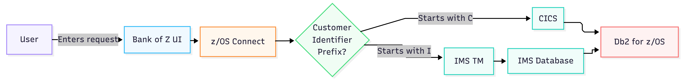

# Application Flow

Bank of Z uses a hybrid architecture that combines a modern web interface with IBM Z transaction-processing systems. Banking requests are submitted through a browser-based application and processed by either CICS or IMS Transaction Manager (IMS TM), depending on the customer identifier.

The following diagram illustrates the flow of requests through the Bank of Z application.

## Request Processing Flow

A typical request follows these steps:

1. A user performs a banking operation through the Bank of Z UI.
2. The Bank of Z UI determines the appropriate transaction-processing path based on the customer identifier.
3. The Bank of Z UI sends the request to z/OS Connect through a REST API.
4. z/OS Connect forwards the request to the selected transaction-processing environment.
5. CICS or IMS Transaction Manager (IMS TM) runs the required business logic and accesses the appropriate data sources.
6. Data is retrieved from or updated in the corresponding Db2 or IMS database, depending on the processing path and operation.
7. The transaction result is returned through z/OS Connect to the Bank of Z UI.
8. The Bank of Z UI displays the results.

## Routing Logic

Bank of Z routes requests to different transaction-processing environments based on the customer identifier.

| Customer Identifier Pattern | Processing Environment |
|----------------------------|------------------------|
| `Cnnnn` | CICS |
| `Innnn` | IMS TM |

For example, a customer with the identifier `C1234` is processed through the CICS application path, while a customer with the identifier `I1234` is processed through the IMS TM application path.

This routing model demonstrates how multiple IBM Z transaction-processing technologies can be integrated into a single application while maintaining a consistent user experience.

## Request Flow Diagram

## External Integration

For selected operations, Bank of Z can exchange information with external systems through IBM MQ. This enables integration scenarios such as processing inbound money transfer requests from external banking applications.

This architecture enables a single web application to provide a consistent user experience while supporting business functions that execute across multiple IBM Z transaction-processing environments.