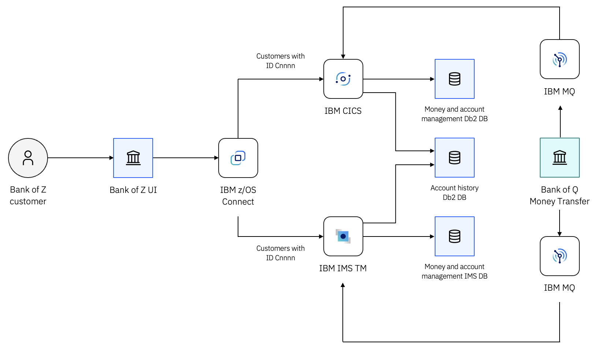

# Architecture Overview

Bank of Z uses a hybrid architecture that combines modern web technologies with IBM Z transaction-processing systems. The application integrates CICS, IMS Transaction Manager (IMS TM), Db2 for z/OS, IMS databases, z/OS Connect, and IBM MQ into a single banking solution.

Requests are submitted through a browser-based user interface and routed through z/OS Connect to the appropriate transaction-processing environment. Business functions run within either CICS or IMS TM while sharing common data and application services.

This architecture demonstrates how modern interfaces, APIs, transaction-processing systems, databases, and messaging technologies can work together within an IBM Z environment.

The application combines:

- A browser-based user interface
- z/OS Connect APIs
- CICS transaction processing
- IMS Transaction Manager (IMS TM)
- Db2 databases
- IMS databases
- MQ messaging
- IBM Z development and DevSecOps tooling

Although the underlying transaction-processing path differs, users interact with a single banking application through a consistent web interface. This architecture demonstrates how multiple IBM Z transaction-processing technologies can be integrated into a unified application while supporting modern APIs, shared data services, and DevSecOps workflows.